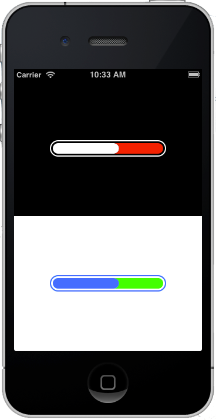

# THProgressView

`UIView` subclass that mimics Twitter for iOS progress bar.



## Installation

Drag the contents of `THProgressView/` into your project.

## Usage

`THCircularProgressView` is simply a `UIView` subclass so just instantiate it and add it a view hieararchy.

```objc
CGRect rect = ...
THProgressView *progressView = [[THProgressView alloc] initWithFrame:rect];
progressView.borderTintColor = [UIColor whiteColor];
progressView.progressTintColor = [UIColor whiteColor];
[progressView setProgress:0.5f animated:YES]; // floating-point value between 0.0 and 1.0
```

The sample project in `/Demo` contains a couple examples.

## License

[MIT License](http://en.wikipedia.org/wiki/MIT_License) (c) [Tiago Henriques](mailto:tiagomnh@gmail.com)